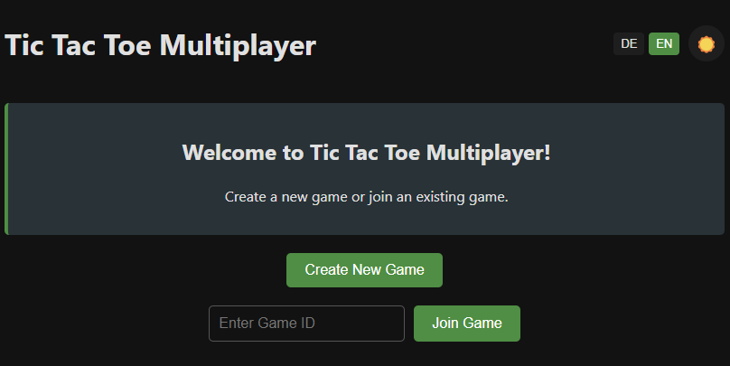
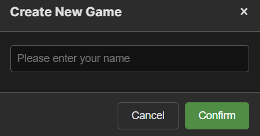
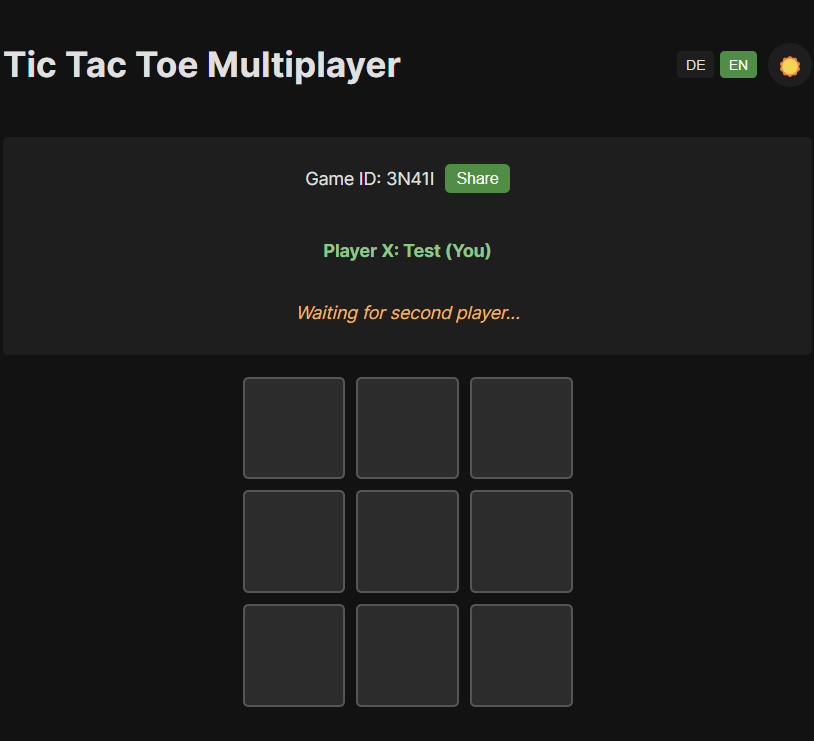
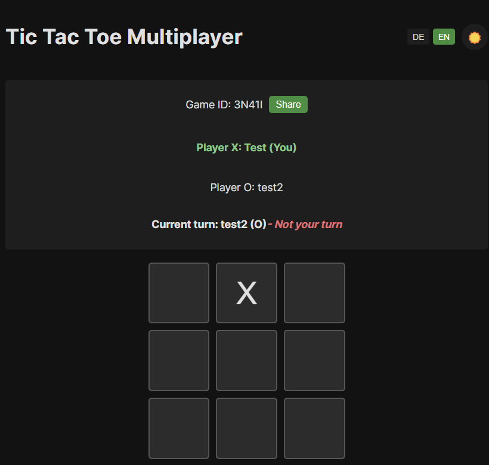
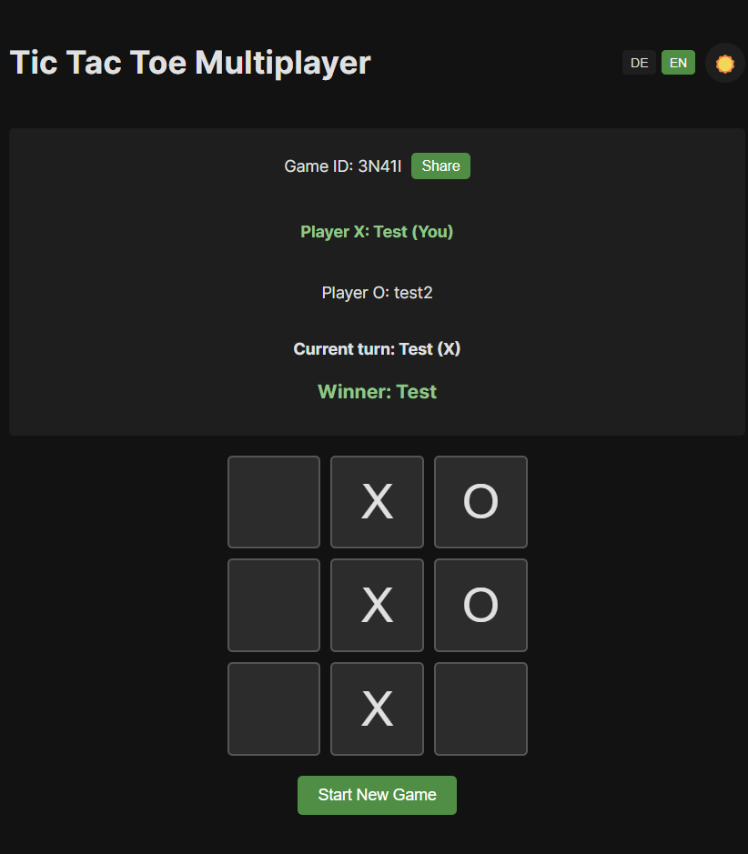

# Tic Tac Toe Multiplayer Game

Ein Multiplayer Tic Tac Toe Spiel mit WebSocket-Unterstützung, gebaut mit React, TypeScript, Node.js und Socket.IO.

## Features

- Echtzeit-Multiplayer über WebSocket
- Spiel erstellen und beitreten
- Responsive Design
- Docker-Unterstützung

## Voraussetzungen

- Docker und Docker Compose
- Node.js (für lokale Entwicklung)

## Installation und Start

1. Klonen Sie das Repository:
```bash
git clone <repository-url>
cd tic-tac-toe
```

2. Erstellen Sie eine `.env` Datei im Root-Verzeichnis (optional):
```env
FRONTEND_PORT=5173
BACKEND_PORT=3001
FRONTEND_URL=http://localhost:5173
BACKEND_URL=http://localhost:3001
```

3. Starten Sie die Anwendung mit Docker Compose:
```bash
docker-compose up --build
```

Die Anwendung ist nun verfügbar unter:
- Frontend: http://localhost:5173
- Backend: http://localhost:3001

## Lokale Entwicklung

### Frontend
```bash
cd frontend
npm install
npm run dev
```

### Backend
```bash
cd backend
npm install
npm run dev
```

## Spielanleitung

1. Öffnen Sie die Anwendung in zwei verschiedenen Browsern oder Browser-Tabs
2. Klicken Sie auf "Create New Game" im ersten Browser
3. Kopieren Sie die Game ID und geben Sie sie im zweiten Browser ein
4. Klicken Sie auf "Join Game"
5. Spielen Sie abwechselnd, bis ein Gewinner feststeht oder das Spiel unentschieden ist

## Screenshots







## Technologien

- Frontend:
  - React
  - TypeScript
  - Socket.IO Client
  - Vite

- Backend:
  - Node.js
  - Express
  - Socket.IO
  - TypeScript

- Deployment:
  - Docker
  - Docker Compose 
